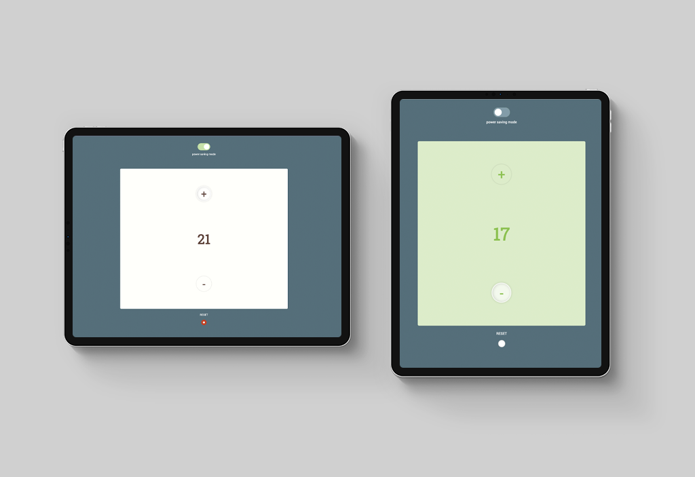

# Thermostat
I created this programme as part of a challenge at [Makers Academy](http://www.makersacademy.com). 

Developed using TDD and pair programming, working with several different pairs on rotation over several afternoons. 

The app has been created with JavaScript, JQuery, CSS and HTML.



## Getting Started ##

1. Fork this repo, and clone to your local machine. Navigate into the folder.
2. Open `index.html` in your browser.

## Running tests ##

1. Open `SpecRunner.html` in your browser

## Specification ##

See original challenge instructions [here](https://github.com/makersacademy/course/tree/master/thermostat) (private repo).

User stories below developed from challenge specification.

## User Stories

```
As a homeowner, 
so that I can set the temperature in my home, 
I would like my thermostat set to a default of 20 degrees.

As a homeowner's daughter
so that I can warm up my bedroom,
I would like to increase the set temperature by a certain amount.

As a homeonwer,
so that I don't waste money, 
I would like to decrease the set temperature by a certain amount.

As a landlord,
so that the pipes don't freeze,
I would like to set a minimum temperature of 10 degrees. 

As a homeowner, 
so that I can save on bills,
I want a powersaving mode which will set maximum temperature to 25 degrees.

As a homeowner's daughter, 
so that I turn the thermostat up to the max of 32,
I would like to be able to turn off power saving mode.

As a homeowner,
so that everyone can wear their jumpers inside,
I want a reset button that changes the temperature back to 20 degrees.

As a homeowner,
so that I can help save the planet,
I would like to see my thermostat's current energy useage.
```
